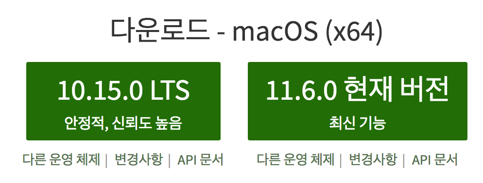

## 설치 및 실행

### 1. Node.js 설치 유무 확인

확인방법은 터미널에서 `node -v`를 입력하면 `v8.xx.x`과 같이 node버전이 표시된다면 2번은 건너뛰시고 3번부터 진행해주세요.

터미널이 뭔지 모르신다면 여길 봐주세요. 운영체제 상에서 시스템에 접근할 수 있는 도구가 mac은 터미널 window는 cmd 인데요.

먼저 mac기준으로 설명하면 우측상단에 돋보기 아이콘을 클릭하셔서 터미널 or terminal 이라고 입력하시고

window는 작업표시줄 -> 실행에서 cmd를 입력하시면 됩니다. 그럼 검정색 창이 뜨는데요 여기서 `node -v`를 입력해서 `v8.xx.x` 

이러한 형태의 문자가 표시되는지 확인하시고 안뜬다면 2번부터 진행해주세요.

### 2. Node.js 설치가 안되어있는 경우 (설치를 해야 합니다.)

node.js 사이트에서 node.js installer를 다운로드 합니다. <a href="http://www.nodejs.org" target="_blank">Node.js 홈페이지 링크</a>

Node.js 설치화면 입니다. 현재 자신의 컴퓨터 운영체제를 확인 후 다운로드는 현재버전으로 설치해주세요 11.6 버전으로 설치!

### 3. github에 제출한 과제 설치하기

터미널 or cmd에서 `git clone https://github.com/radlohead/styleshare` 해당 명령어를 실행하면 

styleshare라는 폴더가 설치됩니다. 해당 폴더를 설치하고 싶은 경로에서 명령어를 실행해주세요.

### 4. 설치한 과제 모듈 설치 후 실행하기

styleshare폴더로 이동 후 이동 방법은 3번을 실행했다면 터미널이나 cmd에서 `cd styleshare`라는 명령어를 입력하면

터미널 or cmd에서 `No such file or directory` 이런 에러가 없이 `c:\styleshare` 대략 이런 형태가 나타났다면 성공입니다. 

이제 모듈 설치 후에 바로 실행해보겠습니다.

`npm install or yarn install`을 실행해서 필요한 모듈을 설치합니다. yarn은 npm보다 빠른 실행속도를 가진 도구인데 모르셔도 상관없습니다. 

우리에게는 npm이 있습니다. 설치가 꽤 오래걸릴텐데요 모두 설치가 끝났다면

`npm start or yarn start`를 입력해서 실행을 해야 합니다. 

가상서버로 3000, 3003, 3004번을 쓰지 않는다면 문제없이 
실행이 되는데요 만약 해당 포트번호의 가상서버를 쓰고 있다면 해당 가상서버를 종료 후 실행해 주시면 됩니다.

감사합니다.
